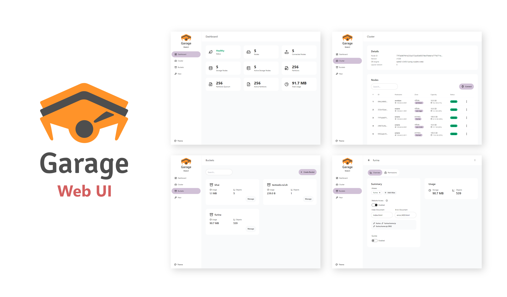

# Garage Web UI

[](misc/img/garage-webui.png)

A simple admin web UI for [Garage](https://garagehq.deuxfleurs.fr/), a self-hosted, S3-compatible, distributed object storage service.

[ [Screenshots](misc/SCREENSHOTS.md) | [Install Garage](https://garagehq.deuxfleurs.fr/documentation/quick-start/) | [Garage Git](https://git.deuxfleurs.fr/Deuxfleurs/garage) ]

## Features

- Garage health status
- Cluster & layout management
- Create, update, or view bucket information
- Integrated objects/bucket browser
- Create & assign access keys

## Installation

The Garage Web UI is available as a single executable binary and docker image. You can install it using the command line or with Docker Compose.

### Docker CLI

```sh
$ docker run -p 3909:3909 -v ./garage.toml:/etc/garage.toml:ro --restart unless-stopped --name garage-webui khairul169/garage-webui:latest
```

### Docker Compose

If you install Garage using Docker, you can install this web UI alongside Garage as follows:

```yml
services:
  garage:
    image: dxflrs/garage:v1.0.1
    container_name: garage
    volumes:
      - ./garage.toml:/etc/garage.toml
      - ./meta:/var/lib/garage/meta
      - ./data:/var/lib/garage/data
    restart: unless-stopped
    ports:
      - 3900:3900
      - 3901:3901
      - 3902:3902
      - 3903:3903

  webui:
    image: khairul169/garage-webui:latest
    container_name: garage-webui
    restart: unless-stopped
    volumes:
      - ./garage.toml:/etc/garage.toml:ro
    ports:
      - 3909:3909
    environment:
      API_BASE_URL: "http://garage:3903"
      S3_ENDPOINT_URL: "http://garage:3900"
```

### Without Docker

Get the latest binary from the [release page](https://github.com/khairul169/garage-webui/releases/latest) according to your OS architecture. For example:

```sh
$ wget -O garage-webui https://github.com/khairul169/garage-webui/releases/download/1.0.9/garage-webui-v1.0.9-linux-amd64
$ chmod +x garage-webui
$ sudo cp garage-webui /usr/local/bin
```

Run the program with specified `garage.toml` config path.

```sh
$ CONFIG_PATH=./garage.toml garage-webui
```

If you want to run the program at startup, you may want to create a systemd service.

```sh
$ sudo nano /etc/systemd/system/garage-webui.service
```

```
[Unit]
Description=Garage Web UI
After=network.target

[Service]
Environment="PORT=3919"
Environment="CONFIG_PATH=/etc/garage.toml"
ExecStart=/usr/local/bin/garage-webui
Restart=always

[Install]
WantedBy=default.target
```

Then reload and start the garage-webui service.

```sh
$ sudo systemctl daemon-reload
$ sudo systemctl enable --now garage-webui
```

### Configuration

To simplify installation, the Garage Web UI uses values from the Garage configuration, such as `rpc_public_addr`, `admin.admin_token`, `s3_web.root_domain`, etc.

Example content of `config.toml`:

```toml
metadata_dir = "/var/lib/garage/meta"
data_dir = "/var/lib/garage/data"
db_engine = "sqlite"
metadata_auto_snapshot_interval = "6h"

replication_factor = 3
compression_level = 2

rpc_bind_addr = "[::]:3901"
rpc_public_addr = "localhost:3901" # Required
rpc_secret = "YOUR_RPC_SECRET_HERE"

[s3_api]
s3_region = "garage"
api_bind_addr = "[::]:3900"
root_domain = ".s3.domain.com"

[s3_web] # Optional, if you want to expose bucket as web
bind_addr = "[::]:3902"
root_domain = ".web.domain.com"
index = "index.html"

[admin] # Required
api_bind_addr = "[::]:3903"
admin_token = "YOUR_ADMIN_TOKEN_HERE"
metrics_token = "YOUR_METRICS_TOKEN_HERE"
```

However, if it fails to load, you can set `API_BASE_URL` & `API_ADMIN_KEY` environment variables instead.

### Environment Variables

Configurable envs:

- `CONFIG_PATH`: Path to the Garage `config.toml` file. Defaults to `/etc/garage.toml`.
- `BASE_PATH`: Base path or prefix for Web UI.
- `API_BASE_URL`: Garage admin API endpoint URL.
- `API_ADMIN_KEY`: Admin API key.
- `S3_REGION`: S3 Region.
- `S3_ENDPOINT_URL`: S3 Endpoint url.

### Authentication

Enable authentication by setting the `AUTH_USER_PASS` environment variable in the format `username:password_hash`, where `password_hash` is a bcrypt hash of the password.

Generate the username and password hash using the following command:

```bash
htpasswd -nbBC 10 "YOUR_USERNAME" "YOUR_PASSWORD"
```

> If command 'htpasswd' is not found, install `apache2-utils` using your package manager.

Then update your `docker-compose.yml`:

```yml
webui:
  ....
  environment:
    AUTH_USER_PASS: "username:$2y$10$DSTi9o..."
```

### Running

Once your instance of Garage Web UI is started, you can open the web UI at http://your-ip:3909. You can place it behind a reverse proxy to secure it with SSL.

## Development

This project is bootstrapped using TypeScript & React for the UI, and Go for backend. If you want to build it yourself or add additional features, follow these steps:

### Setup

```sh
$ git clone https://github.com/khairul169/garage-webui.git
$ cd garage-webui && pnpm install
$ cd backend && pnpm install && cd ..
```

### Running

Start both the client and server concurrently:

```sh
$ pnpm run dev # or npm run dev
```

Or start each instance separately:

```sh
$ pnpm run dev:client
$ cd backend
$ pnpm run dev:server
```

## Troubleshooting

Make sure you are using the latest version of Garage. If the data cannot be loaded, please check whether your instance of Garage has the admin API enabled and the ports are accessible.

If you encounter any problems, please do not hesitate to submit an issue [here](https://github.com/khairul169/garage-webui/issues). You can describe the problem and attach the error logs.
